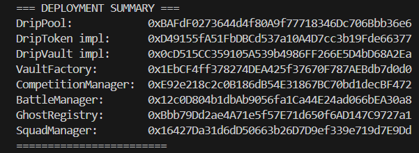

# 💧 Drip — Social Yield Protocol on Initia

> **Automated yield compounding, PvP yield battles, and ghost operators — deployed as its own Initia EVM appchain (drip-1).**

## Initia Hackathon Submission

- **Project Name**: Drip

### Project Overview

Drip is a social yield protocol on Initia where users deposit INIT into managed vaults, earn yield through DripPool lending, and compete in PvP yield battles. Ghost operators auto-compound yield 24/7 using Initia's native auto-signing feature, eliminating gas friction for depositors. Drip turns passive yield farming into an active, competitive, and social experience — deployed as its own Initia EVM rollup (drip-1) with zero-fee vault creation.

### Implementation Detail

- **The Custom Implementation**: Drip implements a full DeFi stack of 8 smart contracts: EIP-1167 vault factory, built-in lending pool (DripPool) as the yield source, a trustless ghost operator registry for automated compounding, 1v1 PvP yield battles with INIT wagers, multi-vault yield competitions, and social squads. The core innovation is the Ghost Operator system — permissionless bots that can ONLY call `compound()` on vaults, earning 0.1% of yield while being cryptographically prevented from withdrawing or stealing funds.
- **The Native Feature**: Drip uses **auto-signing** via Initia's InterwovenKit. When a vault creator delegates a Ghost Operator, the ghost's wallet uses auto-signing to execute `compound()` transactions automatically without manual approval popups. This enables true 24/7 hands-off yield compounding — the ghost harvests DripPool interest and reinvests it into the vault continuously, with zero user interaction required after the initial delegation.

### How to Run Locally

1. Clone the repo and install frontend dependencies:
   ```bash
   git clone https://github.com/KamiliaNHayati/Drip.git
   cd Drip/frontend && npm install
   ```
2. Start the Drip rollup (requires [Weave CLI](https://github.com/initia-labs/weave)):
   ```bash
   weave rollup start
   weave opinit start executor
   weave opinit start challenger
   weave relayer start
   ```
3. Start the development server:
   ```bash
   npm run dev
   ```
4. Open `http://localhost:3000` and connect your wallet via InterwovenKit. The frontend connects to the local drip-1 rollup at `http://localhost:8545`.

---

Drip is a DeFi protocol deployed as its own Initia EVM appchain (drip-1). Users deposit INIT into managed vaults, earn yield through DripPool lending, and compete in PvP yield battles. Ghost operators auto-compound yield 24/7 with zero gas fees for depositors.

## 🔗 Links

| | |
|---|---|
| **Rollup Chain ID** | `drip-1` (EVM chain ID: `9786571`) |
| **Hackathon** | INITIATE: The Initia Hackathon (Season 1) |
| **Demo Video** | [YouTube](https://youtu.be/rFdOTHd_KoA) |

## 🏗️ Architecture

```
┌─────────────┐     ┌──────────────┐     ┌─────────────┐
│  DripVault  │────▶│   DripPool   │────▶│  Borrowers  │
│ (per vault) │     │ (lending pool)│    │ (pay 8% APY)│
└──────┬──────┘     └──────────────┘     └─────────────┘
       │                    │
       ▼                    ▼
┌──────────────┐     ┌──────────────┐
│ GhostRegistry│     │  Yield flows │
│ (operators)  │     │  back to     │
└──────────────┘     │  depositors  │
                     └──────────────┘
```

**8 Smart Contracts** deployed on Drip rollup (drip-1):

| Contract | Role |
|----------|------|
| `VaultFactory` | Creates vault proxies via EIP-1167 clones |
| `DripVault` | Per-vault deposit/withdraw/compound logic |
| `DripToken` | ERC20 receipt token (dripINIT) |
| `DripPool` | Built-in lending pool (yield source) |
| `GhostRegistry` | Trustless ghost operator registry |
| `BattleManager` | 1v1 PvP yield battles with INIT wagers |
| `CompetitionManager` | Multi-vault yield competitions |
| `SquadManager` | Social squads with projected yield boosts |

## ✨ Key Features

### 🏦 Yield Vaults
- Anyone can create a vault (free — zero creation fee)
- Deposit INIT → receive dripINIT (receipt token that grows in value)
- Yield comes from DripPool borrower interest (8% APY)
- Creator earns a configurable performance fee (5–20%) from vault yield

### 👻 Ghost Operators
- Register as a ghost operator (free)
- Vault creators delegate compounding to ghosts (5 INIT one-time fee)
- Ghosts call `compound()` automatically — earn 0.1% of yield per compound
- Ghost wallets can ONLY compound — they cannot withdraw or steal funds

### ⚔️ PvP Yield Battles
- Vault creators challenge rival vaults to 1v1 yield wars
- Both sides stake INIT as wager (min 10 INIT)
- Winner (highest PPS growth) takes 80% of combined pot
- Protocol takes 20%; challenger wins tiebreaker

### 🤝 Social Squads
- Team up in squads of up to 10 wallets (10 INIT creation fee)
- With ≥ 2 members, activate a 24-hour projected yield boost for 1 INIT
- **Note:** Squad boosts are a UI projection in V1. On-chain yield multipliers are planned for V2.

### 🏦 DripPool Lending
- Depositors' INIT becomes lending capital
- Borrowers add collateral and borrow INIT at 8% APY
- Interest flows back as yield to vault depositors

### 🛡️ Safety Features
- Initia Connect oracle integration for price monitoring
- Defensive mode: vault pauses compounding after 3 consecutive price drops
- ReentrancyGuard on all state-changing functions
- SafeERC20 for all token transfers
- Emergency mode in DripPool (halts deposits/borrows, always allows withdrawals)
- Dead shares protection against ERC4626 inflation attacks

## 🔧 Initia-Native Features Used

| Feature | Implementation |
|---------|---------------|
| **InterwovenKit** | Wallet connection via `@initia/interwovenkit-react` with Privy social login |
| **Own Appchain (drip-1)** | All 8 contracts deployed on drip-1 EVM rollup |
| **Auto-Signing** | Ghost operators use auto-signing for automated compound transactions |
| **Connect Oracle** | Enshrined price feed for defensive mode guard |
| **wagmi + viem** | EVM-native transaction signing for all contract interactions |

## 🚀 Getting Started

### Prerequisites
- Node.js 18+
- Foundry (for contracts)
- Wallet with testnet INIT ([faucet](https://faucet.initia.tech))

### Frontend
```bash
cd frontend
npm install
npm run dev
# Open http://localhost:3000
```

### Contracts
```bash
cd contracts
forge install
forge test
forge script script/DeployAll.s.sol --broadcast --rpc-url $RPC_URL
# Then seed the lending pool:
forge script script/Seed.s.sol --broadcast --rpc-url $RPC_URL
```

## 📍 Deployed Contracts (drip-1 Rollup)

Cosmos Chain ID: `drip-1` · EVM Chain ID: `9786571` · RPC: `http://localhost:8545`

| Contract | Address |
|----------|---------|
| DripPool | `0xBAFdF0273644d4f80A9f77718346Dc706Bbb36e6` |
| DripToken (impl) | `0xD49155fA51FbDBCd537a10A4D7cc3b19Fde66377` |
| DripVault (impl) | `0x0cD515CC359105A539b4986FF266E5D4bD68A2Ea` |
| VaultFactory | `0x1EbCF4ff378274DEA425f37670F787AEBdb7d0d0` |
| CompetitionManager | `0xE92e218c2c0B186dB54E31867BC70bd1decBF472` |
| BattleManager | `0x12c0D804b1dbAb9056fa1Ca44E24ad066bEA30a8` |
| GhostRegistry | `0xBbb79Dd2ae4A71e5f57E71d650f6AD147C9727a1` |
| SquadManager | `0x16427Da31d6dD50663b26D7D9ef339e719d7E9Dd` |
| Connect Oracle (precompile) | `0x031ECb63480983FD216D17BB6e1d393f3816b72F` |
| INIT ERC20 (drip-1) | `0x042adD9e80f7a23Ab71D5e1d392af1d3928B7D05` |

> DripVault and DripToken are deployed per-vault via VaultFactory as EIP-1167 minimal proxies.

## 🛠️ Local Rollup Proof (drip-1)
While our live demo uses the `evm-1` testnet for ease of interaction, the Drip Protocol is fully configured and deployed on our own local `drip-1` rollup using Weave CLI. 




## ⚠️ Known Limitations (Honest Disclosure)

These are intentional trade-offs for hackathon scope:

1. **Single-asset lending:** DripPool uses INIT as both collateral and borrowed asset. In production, collateral would be different assets (ETH, USDC) with Connect oracle price feeds for proper LTV enforcement. For the demo, the admin seeds a borrow position to generate visible yield.

2. **Squad boosts are UI-only:** The projected APY boost display in the frontend is a UI projection. Actual on-chain yield is not modified in V1. On-chain multipliers are planned for V2.

3. **Ghost compound frequency:** Ghost operators call `compound()` via scripts or manual triggers in the demo. Production would use an always-on keeper bot SDK.

4. **Local rollup only:** The drip-1 rollup runs locally via Weave CLI. The gas token (udrip) cannot be swapped to/from INIT or other tokens in the current setup. Judges need to run the rollup locally to interact with the contracts.

## 🧪 Testing

```bash
cd contracts
forge test -v
```

Test coverage spans all 8 contracts including DripPool, DripVault, DripToken, VaultFactory, BattleManager, CompetitionManager, GhostRegistry, and SquadManager.

## 📁 Project Structure

```
├── contracts/          # Solidity smart contracts (Foundry)
│   ├── src/           # Contract source files
│   ├── test/          # Test files (one per contract)
│   └── script/        # DeployAll.s.sol + Seed.s.sol
├── frontend/          # Next.js 16 frontend
│   ├── src/app/       # App router pages
│   ├── src/components/# React components
│   └── src/lib/       # Contract ABIs & deployed addresses
└── design/            # Design assets
```

## 👥 Team

Built for **INITIATE: The Initia Hackathon (Season 1)**

## 📄 License

MIT
